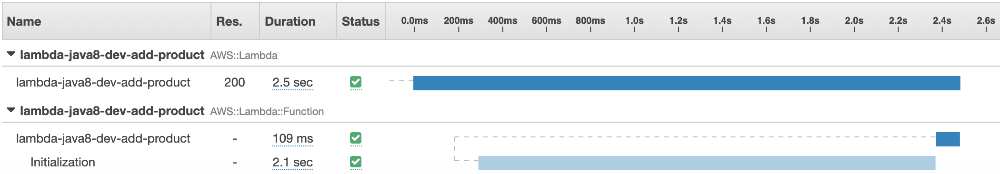
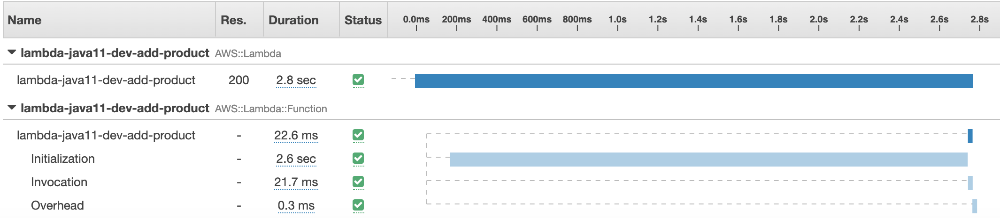

# AWS Lambda Java 

Revisiting cold starts in Java after my first review at https://github.com/drissamri/aws-lambda-runtime-coldstart in 04/2019.
###  Cold start performance

```
./gradlew clean build
serverless deploy
curl --header "Content-Type: application/json" \
 --request POST  \
 --data ‘{“name”:”DRISS”}’ \
 <<INSERT URL>>
```

### Java 8: 2.5s


### Java 11: 2.8s
